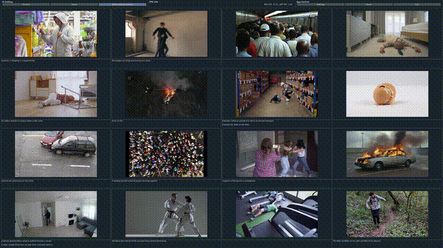
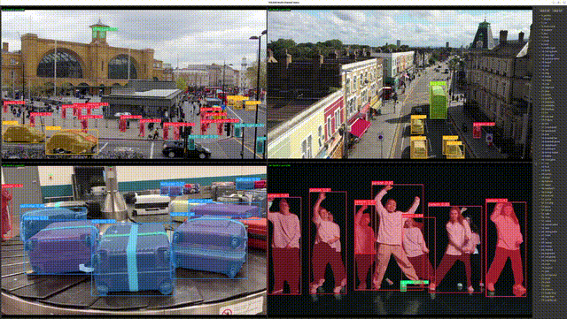
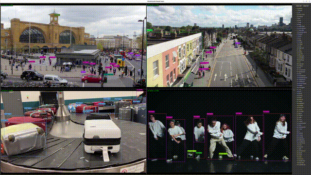
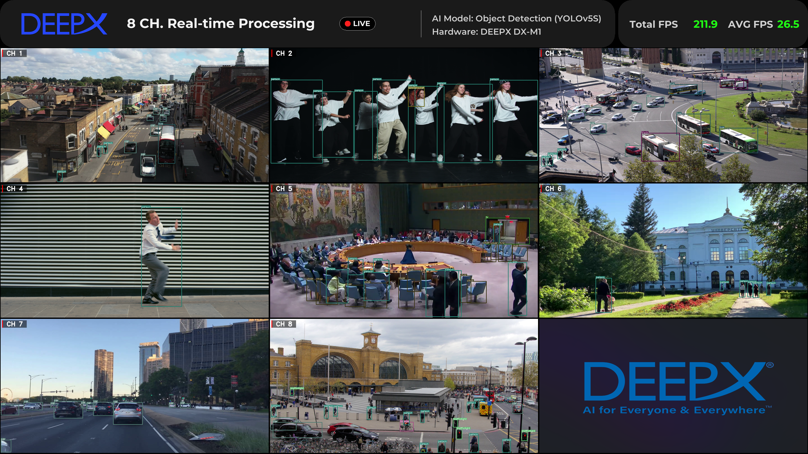

# DX-DEMO

A collection of demo applications for DEEPX NPU inference.

## Demos

| Demo | Model | Description |
|------|-------|-------------|
| [dx_clip_demo](https://github.com/DEEPX-AI/dx_clip_demo) | CLIP | Real-time text-video similarity matching powered by CLIP on DeepX NPU |
| [yolo26seg_4ch_demo](yolo26seg_4ch_demo/README.md) | YOLOv11 Segmentation | Real-time instance segmentation with mask overlay across up to 4 input channels |
| [yolo26_4ch_demo](yolo26_4ch_demo/README.md) | YOLO26 | Real-time object detection with per-class BBOX toggle panel across up to 4 input channels |
| [yolo_multi_demo](yolo_multi_demo/README.md) | YOLOv5 | Multi-channel object detection processing many input channels simultaneously (up to 100), with config-driven layouts and camera-expand grid |

## Screenshots

### DX-CLIP Demo



### YOLO26 Segmentation 4-Channel Demo



### YOLO26 4-Channel Demo



### YOLO Multi-Channel Demo



## Prerequisites

### dx_clip_demo

Requires **DX-RT** (DeepX Runtime) to be built and installed.
Refer to the [dx-all-suite installation guide](https://github.com/DEEPX-AI/dx-all-suite/blob/main/docs/source/installation.md) for full details.

### Installing DX-RT via dx-all-suite

```bash
mkdir -p /project/workspace/pathname
cd /project/workspace/pathname
git clone --recurse-submodules https://github.com/DEEPX-AI/dx-all-suite.git
cd ./dx-all-suite
./dx-runtime/install.sh --all
```

### Activating the virtual environment

```bash
source ./dx-runtime/venv-dx-runtime/bin/activate
```

### yolo26_4ch_demo / yolo26seg_4ch_demo

Requires **dx_stream** (GStreamer plugin) and **pydxs** Python bindings in the venv.

```bash
# Verify dx_stream GStreamer plugin is registered
gst-inspect-1.0 dxinfer

# Verify pydxs is importable in the venv
python -c "import pydxs"
```

If either fails, install dx_stream first (see each demo's `README.md` for instructions). The venv activated by `run_demo.sh` must have `pydxs` installed.

## Demo Details

- **[dx_clip_demo](https://github.com/DEEPX-AI/dx_clip_demo)** — Real-time text-video similarity matching using the CLIP model accelerated on DeepX NPU. Supports up to 16 video channels, camera input, and configurable GUI options.

- **[yolo26seg_4ch_demo](yolo26seg_4ch_demo/README.md)** — Multi-channel instance segmentation demo built entirely on **dx_stream** (native GStreamer, no OpenCV). Each channel runs a hardware-accelerated pipeline: VPU decode → RGA preprocess → NPU inference (YOLO26-seg) → RGA downscale → `dxosd` HW mask/box overlay → RGB conversion → Qt 2×2 tile compositing. Supports video/RTSP/camera inputs, native-FPS playback, and resolution-agnostic display (4K ready).

- **[yolo26_4ch_demo](yolo26_4ch_demo/README.md)** — Multi-channel object detection demo built entirely on **dx_stream** (native GStreamer, no OpenCV). Each channel runs a hardware-accelerated pipeline: VPU decode → RGA preprocess → NPU inference (YOLO26) → RGA downscale → RGB conversion → Qt 2×2 tile compositing. Qt GUI includes a class list panel with per-class checkboxes to toggle BBOX display. Supports video/RTSP/camera inputs, native-FPS playback, and resolution-agnostic display (4K ready).

- **[yolo_multi_demo](yolo_multi_demo/README.md)** — Config-driven multi-channel YOLO object detection scaling to many channels at once (up to 100). Launch selects one of three JSON configurations (standard, PPU, and 100-channel PPU). Features a camera-expand grid layout that promotes the first camera input to the center as a main window, yellow borders around camera cells, and configurable HUD/sidebar font scaling. Run via `run_demo.sh`, which auto-runs `install.sh`/`setup.sh` to build the binary and fetch models/videos on first use.
