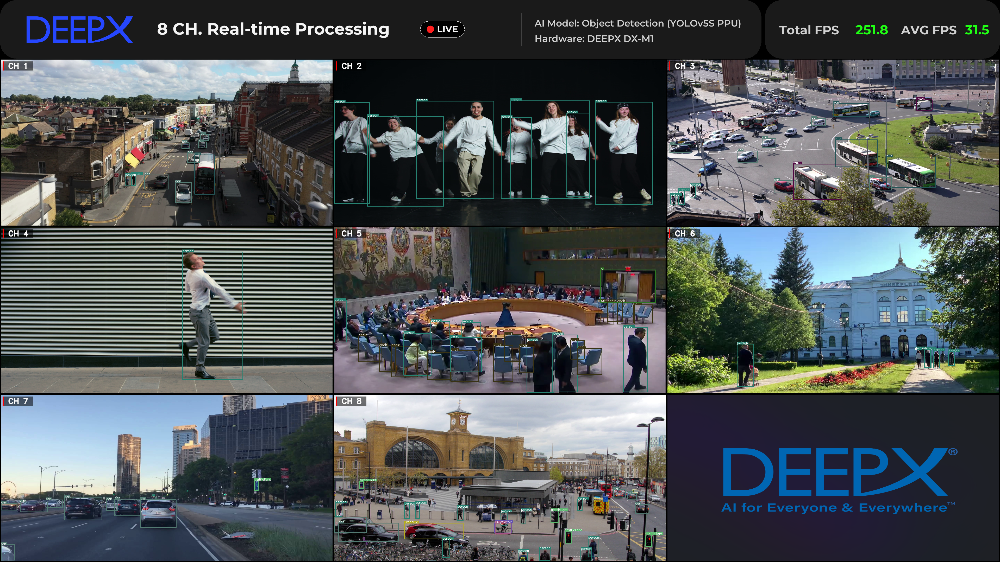
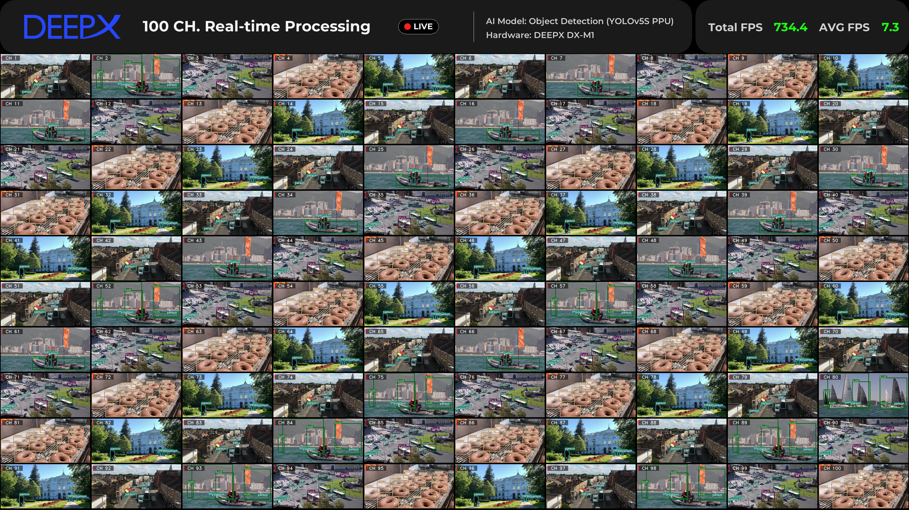

# yolo_multi_demo

`yolo_multi_demo` is a multi-channel YOLO object detection demo that processes multiple input channels simultaneously.

## Overview

- Executable: `bin/yolo_multi_demo`
- Runs from configuration files
- Supports multi-channel object detection scenarios

At launch you can select one of the following configurations:

- `0`: `config/yolo_multi_demo.json`
- `1`: `config/ppu_yolo_multi_demo.json`
- `2`: `config/ppu_yolo_multi_100channel_demo.json`

## How to Run

```bash
cd yolo_multi_demo
./run_demo.sh
```

## What the Run Script Does

`run_demo.sh` handles the following automatically:

1. Runs `install.sh` if `bin/yolo_multi_demo` is missing.
2. Runs `setup.sh` if `assets/models` or `assets/videos` is missing.
3. Passes the configuration file selected from the menu via the `-c` option and starts the demo.

If no input is given, the default value `0` is selected.

## How to Exit

- Press `ESC` or `Q` while running to exit.
- Click the window's **`X`** (close) button to exit.
- Or press **`Ctrl+C`** in the console for a clean shutdown.

> **Windows note:** focusing the display window used to collapse inference
> throughput (~6×), because Windows dynamically boosts the foreground window's
> owning thread priority and it preempts the NPU worker threads. This is fixed
> at the source with `SetProcessPriorityBoost(GetCurrentProcess(), TRUE)` at
> startup (disables the boost process-wide), so the window is a normal focusable
> window and stays at full speed whether focused or not.

## Camera Expand Layout

When `video_sources` includes a camera input (one of `"camera"`, `"camera_image"`, `"camera_video"`), the first camera channel is automatically **expanded into the center of the grid** to emphasize it like a main window. The remaining channels are placed in the surrounding cells as usual.

- The expanded area size is automatically computed to stay within about 20% of the total grid area, and is progressively shrunk if there are not enough cells left for the other inputs (`scale ≤ floor(sqrt(0.20 × cols × rows))`).
- A **yellow border** is drawn around every cell containing a camera input for visual distinction.
- This does not apply when `display_config.expand_mode` (for special channel counts 33/41/61/73) is enabled.

## Additional display_config Options

| Key | Type | Default | Description |
|-----|------|---------|-------------|
| `sidebar_font_scale` | float | 1.0 | Sidebar font scale |
| `fps_value_font_scale` | float | 0.5 | Top HUD FPS value font scale |

Example (part of `video_sources`):

```json
"video_sources": [
    [ "0", "camera" ],
    [ "./assets/videos/cctv-city-road.mov", "offline", 60 ],
    [ "./assets/videos/dance-group.mov",    "offline", 60 ]
]
```

## Stage Profiling (Linux vs Windows)

The demo can write a per-stage timing log so the same workload can be compared
between platforms. Nothing is measured unless profiling is turned on.

### Recording a log

```bash
# Linux
./run_demo.sh --profile                       # -> profile_linux_<N>ch_<timestamp>.log
./bin/yolo_multi_demo -c config/ppu_yolo_multi_640_demo.json --profile linux.log
```

```bat
REM Windows
yolo_multi_demo.exe -c config\ppu_yolo_multi_640_demo.json --profile
```

Run both sides for at least 60 seconds, then exit with `ESC` / `q` / the window
`X`. **The cumulative summary and the CSV block are written on exit**, so a
`kill -9` or a closed terminal leaves an incomplete log.

| Option | Default | Description |
|--------|---------|-------------|
| `--profile [path]` | off | Enable profiling. With no path, `profile_<os>_<N>ch_<timestamp>.log` is used. |
| `--profile_period <ms>` | 5000 | Interval-snapshot dump period |
| `--profile_warmup <ms>` | 3000 | Samples before this are discarded (model load, cache warm-up, first decode) |

It can also be enabled from the config json, in a top-level `profile` block
(the CLI options take precedence):

```json
"profile": {
    "enabled": true,
    "path": "",
    "period_ms": 5000,
    "warmup_ms": 3000,
    "per_channel": true
}
```

### What each stage means

Per-channel worker thread (`ObjectDetection::threadFunc`):

| Stage | Measures |
|-------|----------|
| `worker.loop` | Interval between loop iterations = this channel's actual frame period |
| `worker.busy` | Work per iteration, excluding sleep |
| `worker.get_input` | Capture/decode + letterbox resize (`VideoStream::GetInputStream`) |
| `worker.run_async` | NPU inference enqueue (`InferenceEngine::RunAsync`) |
| `worker.bbox` | bbox coordinate scaling (includes `_lock` wait) |
| `worker.get_output` | Source resize + bbox drawing (`GetOutputStream`) |
| `worker.badge` | `CH n` badge drawing |
| `worker.frame_swap` | Result frame swap (includes `_frameLock` wait) |
| `worker.sleep_req` / `worker.sleep_act` | Requested vs **actual** sleep time |

dxrt callback thread:

| Stage | Measures |
|-------|----------|
| `post.lock_wait` | Waiting for `_lock` |
| `post.yolo` | YOLO decode + NMS on the CPU |
| `post.gap` | Interval between callbacks = the channel's real inference rate (its FPS) |
| `npu.infer` / `npu.latency` | Values reported by dxrt |

Main render thread:

| Stage | Measures |
|-------|----------|
| `main.loop` / `main.busy` | Render loop period / work per iteration |
| `main.compose` | Copying each channel's result frame into the output board |
| `main.fps_calc` | FPS aggregation |
| `main.hud` | Header HUD rendering (Linux only) |
| `main.imshow` | `cv::imshow` |
| `main.waitkey` | `cv::waitKey(1)` |
| `main.winprop` | `cv::getWindowProperty` (window-closed check) |
| `main.sleep_req` / `main.sleep_act` | Requested vs actual sleep time |

The `cpu-ms/s` column is the total time a stage consumed per second summed over
all channels, so the largest number is the bottleneck.

The log header also records the NPU devices actually present (`dxrt` reports
them, so this is independent of the config's display-only `num_devices`), the
raw text of the config json, an estimate of how much memory the preload frame
buffers take, and the process/system memory state.

Every interval report carries a `[memory]` line:

```
[memory] rss 4475 MB | commit 9839 MB | peak_rss 4475 MB | sys_avail 23090/31965 MB | major_faults +18432 (3672/s)
```

A fault rate that stays high means the working set does not fit in physical
memory and pages are being re-read from disk — the usual cause of a stage whose
`avg` is many times its `p50`. On Linux the counter is major faults only (real
disk I/O); on Windows no per-process hard-fault counter exists, so it is the
total fault count (soft faults included) and only its *rate* is meaningful.

The header also records the OS, CPU, RAM, compiler, the full OpenCV build
information, and two probes that often explain a platform gap on their own:

- `clock.granularity_us` — resolution of `steady_clock`
- `sleep(1ms).actual_ms` — how long a 1 ms sleep really takes. Windows runs a
  15.6 ms default timer tick unless something has raised it, which makes every
  `Sleep()` in the pipeline overshoot. Compare this against `sleep_req` vs
  `sleep_act` in the tables.

### Comparing two logs

```bash
python3 scripts/compare_profile.py profile_linux_8ch_*.log profile_win_8ch_*.log
```

It prints the environment differences (mismatches marked `!!`), then a
stage table sorted by the largest absolute difference in total time, with a
`B/A` ratio per stage and `<<<` on anything differing by 30% or more.

## Screenshots

**0: Multi Channel Object Detection**


**1: Multi Channel Object Detection With PPU**



**2: Multi Channel 100ch Object Detection With PPU**


